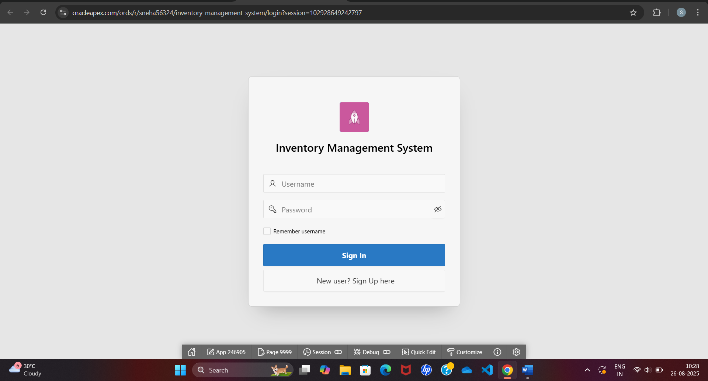
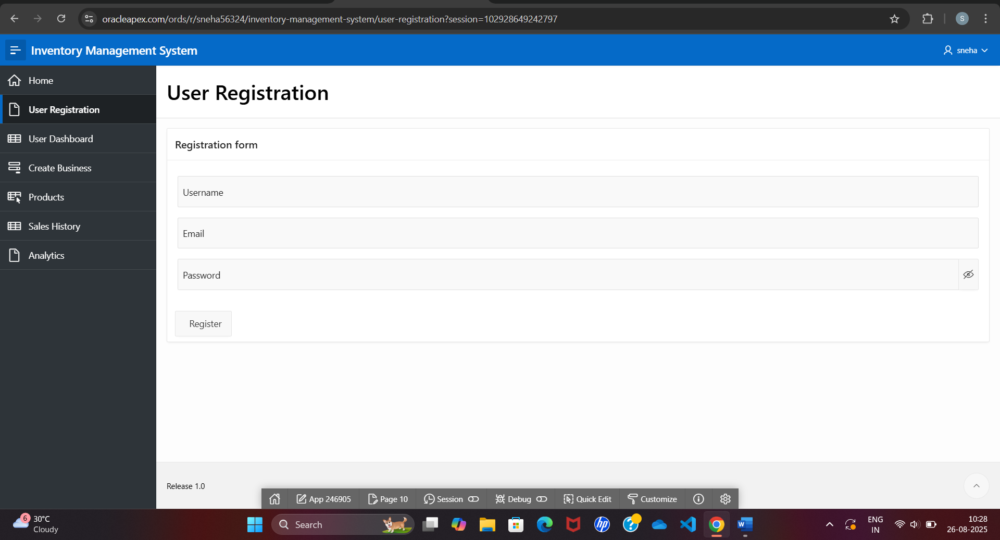
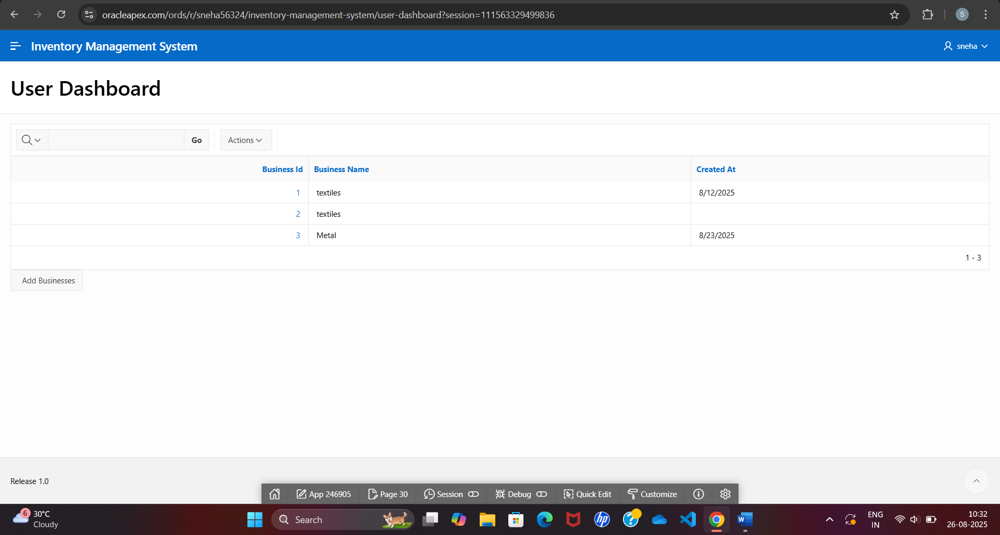
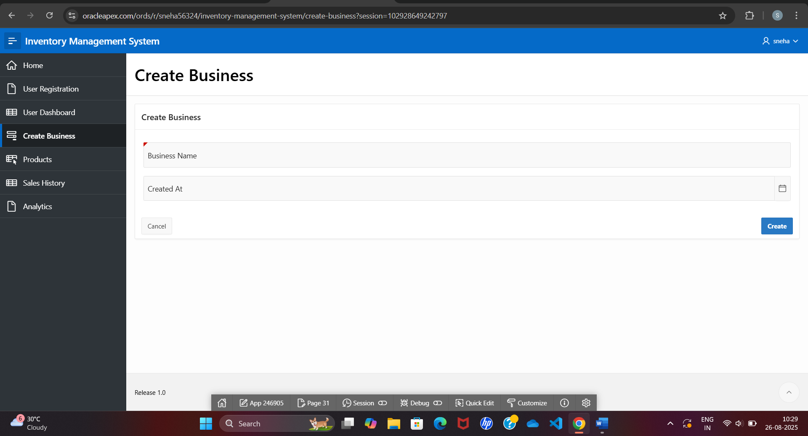
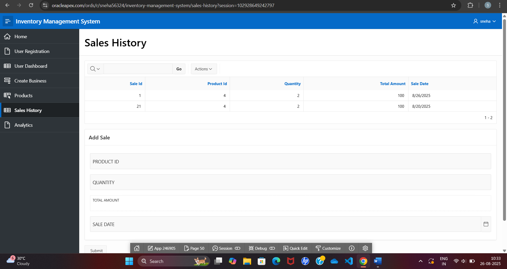
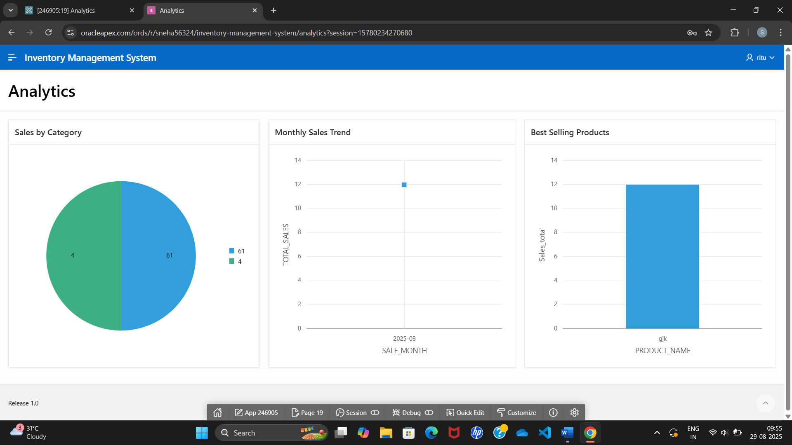

# Inventory Management System

## Overview

The Inventory Management System is a web-based application developed using Oracle APEX, Oracle Database, SQL, and PL/SQL. The application helps businesses efficiently manage inventory, monitor stock levels, track sales, and generate analytical reports. It provides an easy-to-use interface for managing products and business operations.

---

## Features

- User Registration and Login
- Product Management
- Inventory Tracking
- Business Management
- Sales Management
- Analytics Dashboard
- Stock Monitoring
- Database-Driven Operations
- User-Friendly Interface

---

## Technologies Used

- Oracle APEX
- Oracle Database
- SQL
- PL/SQL

---

## Project Structure

Inventory-Management-System/
│
├── application_export.sql
├── README.md
├── login.png
├── signup.png
├── dashboard.png
├── products.png
├── business.png
├── sales.png
└── analytics.png

---

## Screenshots

### Login Page

### Sign Up Page

### Dashboard

### Product Management

### Business Management

### Sales Management

### Analytics Dashboard

---

## Installation Steps

1. Install Oracle Database.
2. Configure an Oracle APEX Workspace.
3. Import the application export file (`application_export.sql`).
4. Run the required database scripts.
5. Launch the application through Oracle APEX.

---

## Key Functionalities

### Product Management
- Add new products
- Update product information
- Delete products
- View product details

### Inventory Tracking
- Monitor stock availability
- Manage inventory records
- Track product quantities

### Sales Management
- Record sales transactions
- Track sales performance
- Generate sales reports

### Analytics
- Visualize inventory data
- Monitor business performance
- Generate analytical insights

---

## Learning Outcomes

- Developed a real-world business application using Oracle APEX.
- Implemented SQL and PL/SQL for database operations.
- Designed responsive forms, reports, and dashboards.
- Improved understanding of inventory management systems.
- Gained experience in database design and application development.

---

## Future Enhancements

- Barcode Scanner Integration
- Email Notifications
- PDF Report Generation
- Excel Export Functionality
- Role-Based Access Control
- Advanced Analytics Dashboard

---

## Author

**Sneha Kumari**

B.Tech (Computer Science & Engineering)

United College of Engineering & Research, Prayagraj

---

## Project Highlights

- Built using Oracle APEX Low-Code Platform
- Database-driven Inventory Management Solution
- Real-Time Inventory Monitoring
- Interactive Dashboard and Reports
- SQL & PL/SQL Based Backend Logic
